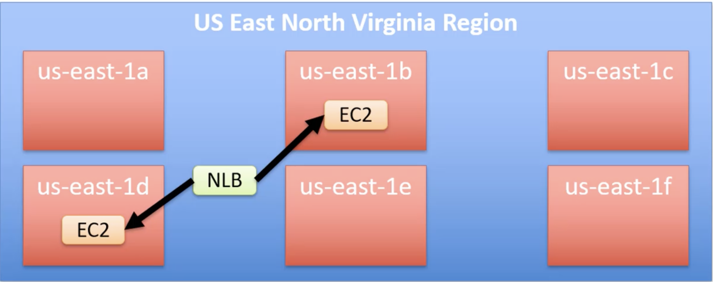

# IaaS, PaaS and SaaS

## IaaS - Infrastructure as a Service

example -> `AWS` - `ec2` and `GCP` -> `Compute Engine`, etc

- Mainly provies `Storage`, `Network`, `Compute` and `Memory`. Configure, Secure, Update and Manage is by the client.
- The core infrastructure(Hardware) maintained by the provider. Unmanaged virtual servers.
- Scaling down or up is super easy.

## PaaS - Platform as a Service

example: `AWS` -> `Elastic beanstalk`, `Salesforce` - `Lightning`

- User can run their own application, only by maintaing the code. Basically you manage the application.
- OS, Scaling, Availability taken care by the provider.

## SaaS - Software as a Service

example - `Zoom`, `Dropbox`, `O365`
- Very less control, completly managed by the provider.

# Private cloud and Public Cloud

## Private Cloud

- Dedicated on-prem hardware. 
- Customer have full control
- Hardware in a colocation facility.
- Limited Scalability, due to customer needs to purchase if anything required.
- Used exclusivly by a single organization

## Public Cloud

- Delivered via the internet
- example - AWS, Azure, GCP, etc.
- Shared by many organization.
- Scaling is super easy, no hardware purchase.
- Flexible pricing

## Hybrid Cloud

- Combine private and public cloud
- VPN or dedicated connection (e.g. AWS Direct Connect)

**Use Cases**

- Scale-out in cloud in case you need an urgent requirment
- Migate to the cloud, in case of the downtime.
- Disaster recovery and backups

# What is AWS?

AWS is a provider who have the Datacenter ready, so you don't need to setup or perform System admin task but you can enjoy the service.

Think it like a you want to own a car but you don't need to fix your car on your own. So you will contact a car dealer and if something goes wrong then your car dealer will take care of the things.

The car dealer is the AWS. And it provides various services. Like if you need more car then they will provide more cars.

# Regions and Availablity Zone

## Regions

- Georaphic Area where you your physical server will be present
- All regions may not not provide all the services
- Prices are different for the different reasons
- Regions are consists of 2 or more Availability zone, for redundency

## Availability Zone**

- Datacenter or sert of datacenters within a region
- Two or more per region
- Every availability zone has different power provider, ISP and many more.
- Unlikly to go down two availbility zone at the same time. So we can LB those to get highest uptime.

## Edge services

- A site that `CloudFront` uses to cache copies of your content for faster delivery to users at any location.
- This provides low latency to the users.

# AWS Services

## Regions Based

- Your service is only availble in a perticular region.
- eg: ec2

## Global

- These are global so region doesn't matter here.
- eg: `IAM`, `Route53`

# Products

https://aws.amazon.com/products/

