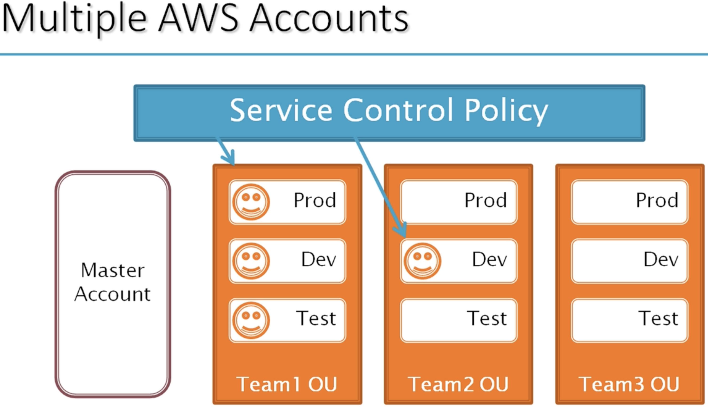

**Managing Multiple AWS Accounts**

 Everytime we create a new AWS account we need to manually go there and assign a `policy`.
 Also in the same way for `Shared Services`

 ## AWS Organizations

- Possible to manage policies centrally and replicate the IAM policies
- Easy to create a new account
- Consolidate billing opiton

- **We can create OU and create accounts inside the OU**
- **We can assign policies directly to the OU level or account label**
- **We can also create nested OU's**

